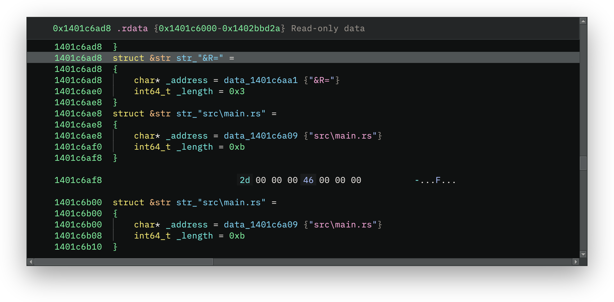
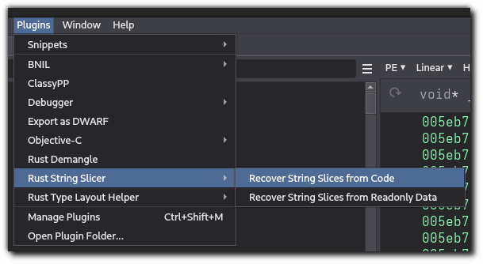
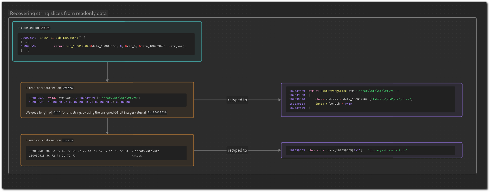
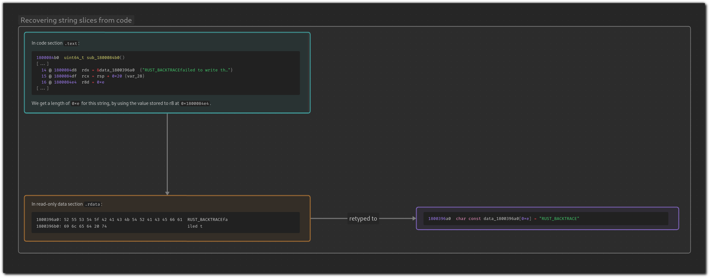

# Rust String Slicer

A Binary Ninja plugin to help find the addresses and lengths of strings in Rust binaries.



## Usage

This plugin provides two new commands:

- _Plugins_ > _Rust String Slicer_ > _Recover String Slices from Readonly Data_
- _Plugins_ > _Rust String Slicer_ > _Recover String Slices from Code_ 



You can view the list of recovered strings and their addresses in the Log window.

![The Binary Ninja log window, showing the following text logged under the "rust_string_slicer.binja_plugin.actions" category: Candidate string slice b'\xc3\xcc\xcc\xcc\xcc\xcc\xcc\xcc' does not decode to a valid UTF-8 string; excluding from final results: 'utf-8' codec can't decode byte 0xc3 in position 0: invalid continuation byte
Recovered string at addr 0x18003d174, len 0x28: "library\core\src\unicode\unicode_data.rs"
Defined new RustStringSlice at 0x18003d2c8
Recovered string at addr 0x18003d174, len 0x28: "library\core\src\unicode\unicode_data.rs"
Defined new RustStringSlice at 0x18003d2e0
Recovered string at addr 0x180037ff4, len 0x2c: "Ll0W8FiHZKeuZFO65DVloBXrq3wo05J9TDdw10yl78k="
Defined new RustStringSlice at 0x180045010
Recovered string at addr 0x180038020, len 0x2c: "GONj/LrybW0VQXVpyZRIvZLFPOqUKx5aBVCmW0o4AoY="](images/recovered-strings-log-border.png)

The plugin will also create a new `RustStringSlice` type, for any strings defined in read-only data sections that are made up of a pointer to string data + the length of that string data. You can view all created strings of this type by examining cross-references to the `RustStringSlice` type.


## How does this work?

The original motivation for this plugin was to recreate the string slicing functionality in the tech preview of the [official IDA Rust Analysis Plugin from Hex-Rays](https://hex-rays.com/blog/rust-analysis-plugin-tech-preview/). That plugin is able to find the lengths of Rust strings, which are not null terminated, via some heuristics for finding the string length data.

The heuristics we use are the following:

- Enumerate all addresses in the binary's read-only data section which have cross-references.
- Treating each of those addresses as the beginning of a potential string literal.
- Follow those cross references to see if there is some information around the site of that cross reference about string length.

The _Recover String Slices from Readonly Data_ command uses cross references which point to a data section. For each of these cross references, try to interpret the cross referenced address as a structure like the following, with some heuristics to determine whether the found length_of_string_literal is reasonable:

```
QWORD address_of_candidate_string_literal
QWORD length_of_string_literal
```




The _Recover String Slices from Code_ command uses cross references which point to a code section. For each of these cross references, check to see if the subsequent instructions contain a move of an immediate value to a memory location; the immediate value is then taken as the string length. For example, for x64 binaries, look for instructions like this:

```
lea rax, <address_of_candidate_string_literal>
mov [rsp+<string_var>.<string_pointer_field>], rax
mov [rsp+<string_var>.<string_length_field>], 15
```




## Development

### Setting up a development environment

To set up a development environment, including setting up a Python virtual environment:

```
python -m venv .venv && . .venv/bin/activate
python -m pip install -r requirements.txt
python -m pip install -r dev-requirements.txt
python $PATH_TO_BINARY_NINJA_INSTALLATION/scripts/install_api.py
```

For formatting, linting, and running unit tests locally, install [Nox](https://nox.thea.codes/en/stable/tutorial.html), then:

```
nox
```

You can also invoke each task separately; see [noxfile.py](noxfile.py) for more details on available tasks:

```
nox -s format
nox -s lint
nox -s test
```

Linting and unit testing (both against multiple Python versions) are also set up in CI on [GitHub Actions](.github/workflows/ci.yml).

### Testing local versions of the plugin

To test the plugin locally in your own Binary Ninja installation during development, create a symbolic link between your development folder, and the [Binary Ninja user plugins folder](https://docs.binary.ninja/guide/index.html#user-folder), so that your development folder is loaded by Binary Ninja on startup as a plugin.

- MacOS:

    ```sh
    ln -s --relative . ~/Library/Application\ Support/Binary\ Ninja/plugins/rust_string_slicer
    ```

- Linux:

    ```sh
    ln -s --relative . ~/.binaryninja/plugins/rust_string_slicer
    ```

- Windows (Powershell):
    ```powershell
    New-Item -ItemType Junction -Value $(Get-Location) -Path "$env:APPDATA\Binary Ninja\plugins\rust_string_slicer
    ```

You should then change the values of the following Python settings in Binary Ninja to point to inside your development folder's virtual environment:

- `python.binaryOverride`: Set this to the path of the Python interpreter inside your development virtual environment, e.g. `$DEVELOPMENT_FOLDER/rust_string_slicer/.venv/bin/python/`
- `python.virtualenv`: Set this to the path of the `site-packages` directory inside your development virtual environment, e.g. `$DEVELOPMENT_FOLDER/rust_string_slicer/.venv/lib/python3.11/site-packages`